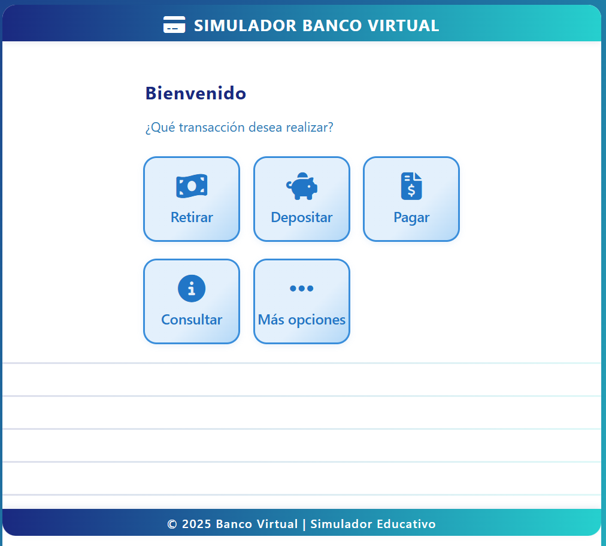

# Curso-Tecnica-de-programaci-n---UNEMI-2025
javascript, vectores, array etc.

## 1: Configurar tu correo en Git local
    Debes usar el mismo correo que está configurado en GitHub.
    Abre la terminal (Git Bash, PowerShell o tu consola favorita) y ejecuta:

## 2: Configuración global (para todos tus repositorios)
    git config --global user.name "Tu Nombre en GitHub"
    git config --global user.email "tu_correo@ejemplo.com"

## 3: Verificar la configuración
    Para revisar lo configurado:
    git config --global --list

# Comando basicos git
    git add .
    git commit -m "detalle del commit"
    git push


# Caso de Estudio: Sistema de Facturación con Vectores


## Contexto
Una empresa de tecnología necesita un sistema de facturación web sencillo, donde se pueda emitir facturas a clientes, agregar productos o servicios, calcular totales y mostrar el detalle de la factura. El Frontend ya está diseñado (ver archivo caso-estudio-factura.html), pero falta toda la lógica en JavaScript.

El objetivo es que los estudiantes implementen la funcionalidad usando vectores (arreglos) para almacenar y manipular los productos agregados a la factura.

## Análisis
- El usuario puede seleccionar productos/servicios de una lista desplegable, indicar la cantidad y agregar el producto al detalle de la factura.
- Cada producto agregado debe aparecer en la tabla de detalle, permitiendo eliminar productos si es necesario.
- Los totales (subtotal, IVA, descuento, total) deben actualizarse automáticamente al agregar o eliminar productos.
- No se debe usar ninguna librería externa, solo JavaScript puro y vectores.

## Requerimientos Funcionales
1. **Agregar productos al detalle**
   - Al seleccionar un producto y cantidad, y presionar “Agregar”, el producto debe añadirse a un vector de productos.
   - Si el producto ya existe en el vector, debe sumarse la cantidad.
2. **Mostrar productos en la tabla**
   - La tabla debe mostrar todos los productos del vector, con sus cantidades, precios unitarios y totales.
   - Cada fila debe tener un botón para eliminar ese producto del vector.
3. **Eliminar productos**
   - Al presionar el botón “✕”, el producto debe eliminarse del vector y la tabla debe actualizarse.
4. **Calcular totales**
   - El subtotal es la suma de los totales de cada producto.
   - El IVA es el 15% del subtotal.
   - El descuento es fijo ($150.00) para efectos del caso.
   - El total es: subtotal + IVA - descuento.
5. **Actualizar la factura en tiempo real**
   - Cada vez que se agregue o elimine un producto, la tabla y los totales deben actualizarse automáticamente.
6. **Validaciones**
   - No se debe permitir agregar productos sin seleccionar uno o con cantidad menor a 1.
   - El precio unitario debe actualizarse automáticamente al seleccionar el producto.

## Requerimientos Técnicos
- Usar arreglos (vectores) para almacenar los productos agregados.
- Manipular el DOM con JavaScript puro (sin frameworks).
- El código debe estar bien comentado y estructurado.
- No modificar el diseño ni el HTML base, solo agregar el script y los eventos necesarios.

### Ejemplo de estructura de vectores separados

```javascript
// Usar vectores separados para cada campo
let descripciones = ["Sistema Web Personalizado", "Licencia Software Empresarial", ...];
let cantidades = [2, 5, ...];
let precios = [3500, 250, ...];
let totales = [7000, 1250, ...];
```

// Cada índice representa el mismo producto en todos los vectores.
// Por ejemplo, descripciones[0], cantidades[0], precios[0], totales[0] corresponden al mismo producto.

## Entregables
- El archivo HTML con el script JavaScript embebido o enlazado.
- El código debe cumplir todos los requerimientos funcionales y técnicos.
- Se evaluará el uso correcto de vectores, manipulación del DOM y lógica de cálculo.

## Sugerencias
- Usar funciones para agregar, eliminar y renderizar productos.
- Usar eventos para manejar los controles del formulario y la tabla.
- Comentar el código explicando el uso de vectores y la lógica implementada.

## Instrucciones de la Tarea

1. Descarga el archivo `caso-estudio-factura.html` y ábrelo en tu editor.
2. Implementa toda la lógica en JavaScript puro, usando vectores separados para cada campo (descripción, cantidad, precio, total).
3. No utilices objetos ni JSON, solo arreglos simples.
4. Agrega el script en la misma página o enlázalo como archivo externo.
5. Debes permitir:
   - Agregar productos al detalle usando el formulario.
   - Mostrar los productos en la tabla y permitir eliminarlos.
   - Calcular y mostrar los totales (subtotal, IVA, descuento, total) en tiempo real.
   - Validar que no se agregue un producto sin seleccionar o con cantidad menor a 1.
   - El precio unitario debe actualizarse automáticamente al seleccionar el producto.
6. Comenta tu código explicando el uso de los vectores y la lógica implementada.
7. No modifiques el diseño ni el HTML base, solo agrega el script y los eventos necesarios.
8. Entrega el archivo HTML con el script funcionando.

---

# Caso de Estudio: Simulador de Cajero Bancario con Vectores



## Contexto
Un banco necesita un simulador de cajero automático (ATM) web para capacitar a su personal y clientes. El sistema debe permitir registrar clientes, iniciar sesión, realizar retiros, depósitos, pagos de servicios y consultar saldo. El Frontend ya está diseñado (ver archivo caso-estudio-simulador-cajero.html), pero falta toda la lógica en JavaScript.

El objetivo es que los estudiantes implementen la funcionalidad usando vectores (arreglos) para almacenar y manipular los datos de clientes y sus movimientos bancarios.

## Análisis
- El sistema debe permitir registrar nuevos clientes con DNI, nombre, capital inicial y contraseña (PIN de 4 dígitos).
- Los clientes pueden iniciar sesión con su DNI y contraseña para acceder a las operaciones bancarias.
- Las operaciones disponibles son: retiro, depósito, pago de servicios y consulta de saldo.
- Todos los movimientos deben registrarse en un historial para poder consultarlos posteriormente.
- No se debe usar ninguna librería externa, solo JavaScript puro y vectores.

## Requerimientos Funcionales

### 1. **Registro de Clientes**
   - El sistema debe permitir registrar nuevos clientes con los siguientes datos:
     - DNI (6-10 dígitos numéricos)
     - Nombre completo
     - Capital inicial (monto con el que abre la cuenta)
     - Contraseña/PIN (4 dígitos numéricos)
   - Validar que el DNI no esté duplicado en el sistema.
   - Todos los datos deben almacenarse en un vector de clientes.

### 2. **Inicio de Sesión (Login)**
   - El cliente debe ingresar su DNI y contraseña para acceder al sistema.
   - Validar que el DNI exista en el vector de clientes.
   - Validar que la contraseña coincida con la almacenada.
   - Si las credenciales son correctas, mostrar la pantalla de bienvenida con el nombre del cliente.
   - Mantener la sesión activa hasta que el cliente decida salir.

### 3. **Retiro de Efectivo**
   - El cliente puede seleccionar montos predefinidos ($10, $20, $30, $50, $80, $100) o ingresar un monto personalizado.
   - El monto debe ser múltiplo de $10.
   - Validar que el cliente tenga saldo suficiente para realizar el retiro.
   - Al realizar el retiro exitosamente:
     - Actualizar el saldo del cliente en el vector.
     - Registrar el movimiento en el historial.
     - Mostrar mensaje de confirmación con el nuevo saldo.

### 4. **Depósito de Efectivo**
   - El cliente puede seleccionar montos predefinidos ($10, $20, $30, $50, $80, $100) o ingresar un monto personalizado.
   - El monto debe ser múltiplo de $10.
   - Al realizar el depósito exitosamente:
     - Actualizar el saldo del cliente en el vector.
     - Registrar el movimiento en el historial.
     - Mostrar mensaje de confirmación con el nuevo saldo.

### 5. **Pago de Servicios**
   - El cliente puede ingresar el nombre del servicio (Luz, Agua, Teléfono, Internet, etc.) y el monto a pagar.
   - Validar que el cliente tenga saldo suficiente para realizar el pago.
   - Al realizar el pago exitosamente:
     - Actualizar el saldo del cliente en el vector.
     - Registrar el movimiento en el historial con el nombre del servicio.
     - Mostrar mensaje de confirmación con el nuevo saldo.

### 6. **Consulta de Saldo y Movimientos**
   - Mostrar el saldo actual del cliente.
   - Mostrar los últimos 5 movimientos realizados por el cliente (retiros, depósitos, pagos).
   - Cada movimiento debe incluir: tipo de operación, descripción, monto y fecha/hora.

### 7. **Actualización en Tiempo Real**
   - El saldo del cliente debe actualizarse automáticamente en todas las pantallas después de cada operación.
   - Los movimientos deben registrarse inmediatamente y estar disponibles para consulta.

### 8. **Validaciones Generales**
   - No permitir retiros o pagos si el saldo es insuficiente.
   - No permitir montos negativos o cero en ninguna operación.
   - Validar que los montos de retiro y depósito sean múltiplos de $10.
   - Validar que la contraseña tenga exactamente 4 dígitos numéricos.
   - Validar que el DNI tenga entre 6 y 10 dígitos numéricos.

## Requerimientos Técnicos
- Usar vectores (arreglos) para almacenar los datos de clientes y movimientos.
- Estructura del vector de clientes: `[dni, nombre, saldo, password]`
- Estructura del vector de movimientos: `[dni, tipo, descripcion, monto, fecha]`
- Manipular el DOM con JavaScript puro (sin frameworks).
- Usar delegación de eventos para manejar los botones dinámicos.
- El código debe estar bien comentado y estructurado.
- No modificar el diseño ni el HTML base, solo agregar el script y los eventos necesarios.

### Ejemplo de estructura de vectores

```javascript
// Vector de clientes (cada cliente es un sub-arreglo)
const clientes = [
    ['0987654321', 'Juan Pérez', 1500, '1234'],
    ['0912345678', 'María González', 2500, '4321'],
    ['0923456789', 'Carlos López', 800, '5678']
];
// Índices: [0]=DNI, [1]=Nombre, [2]=Saldo, [3]=Password

// Vector de movimientos (cada movimiento es un sub-arreglo)
const movimientos = [
    ['0987654321', 'retiro', 'Retiro de efectivo', 50, '2025-11-06 10:30:00'],
    ['0987654321', 'deposito', 'Depósito de efectivo', 100, '2025-11-06 11:45:00'],
    ['0912345678', 'pago', 'Pago de Luz', 25, '2025-11-06 12:15:00']
];
// Índices: [0]=DNI, [1]=Tipo, [2]=Descripción, [3]=Monto, [4]=Fecha
```

## Entregables
- El archivo HTML con el script JavaScript embebido o enlazado.
- El código debe cumplir todos los requerimientos funcionales y técnicos.
- Se evaluará el uso correcto de vectores, manipulación del DOM, validaciones y lógica de negocio.

## Sugerencias
- Crear funciones separadas para cada operación (registrar, login, retirar, depositar, pagar, consultar).
- Usar una función auxiliar para buscar clientes por DNI en el vector.
- Crear una función para actualizar el saldo en todas las pantallas.
- Usar `new Date().toLocaleString('es-EC')` para registrar la fecha y hora de cada movimiento.
- Implementar delegación de eventos para los botones de montos predefinidos.
- Comentar el código explicando el uso de vectores y la lógica implementada.

## Instrucciones de la Tarea

1. Descarga el archivo `caso-estudio-simulador-cajero.html` y ábrelo en tu editor.
2. Implementa toda la lógica en JavaScript puro, usando vectores para almacenar clientes y movimientos.
3. No utilices objetos ni JSON, solo arreglos simples (vectores dentro de vectores).
4. Agrega el script en la misma página o enlázalo como archivo externo.
5. Debes implementar:
   - Registro de clientes con validaciones.
   - Sistema de login con validación de credenciales.
   - Operaciones de retiro con validación de saldo.
   - Operaciones de depósito.
   - Pago de servicios con validación de saldo.
   - Consulta de saldo y últimos movimientos.
   - Actualización automática del saldo en todas las pantallas.
6. Valida todos los datos de entrada:
   - DNI único, numérico y de longitud correcta.
   - Contraseña de 4 dígitos numéricos.
   - Montos positivos y múltiplos de $10 donde corresponda.
   - Saldo suficiente para retiros y pagos.
7. Implementa delegación de eventos para los botones dinámicos (montos predefinidos).
8. Comenta tu código explicando:
   - La estructura de los vectores.
   - Cómo se buscan y actualizan los datos.
   - La lógica de validación implementada.
9. No modifiques el diseño ni el HTML base, solo agrega el script y los eventos necesarios.
10. Entrega el archivo HTML con el script funcionando completamente.

## Casos de Prueba Sugeridos

### Registro
- Registrar un cliente nuevo con datos válidos.
- Intentar registrar un cliente con DNI duplicado (debe mostrar error).
- Intentar registrar con contraseña de 3 dígitos (debe mostrar error).

### Login
- Iniciar sesión con credenciales válidas.
- Intentar login con DNI inexistente (debe mostrar error).
- Intentar login con contraseña incorrecta (debe mostrar error).

### Retiro
- Realizar retiro con saldo suficiente.
- Intentar retiro con saldo insuficiente (debe mostrar error).
- Intentar retiro de monto no múltiplo de $10 (debe mostrar error).

### Depósito
- Realizar depósito válido y verificar actualización de saldo.

### Pago
- Realizar pago de servicio con saldo suficiente.
- Intentar pago con saldo insuficiente (debe mostrar error).

### Consulta
- Verificar que se muestren los últimos movimientos del cliente.
- Verificar que el saldo se actualice en tiempo real.
