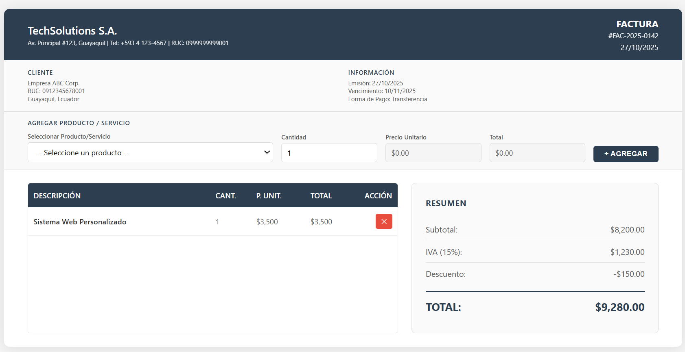

# Curso-Tecnica-de-programaci-n---UNEMI-2025
javascript, vectores, array etc.

## 1: Configurar tu correo en Git local
    Debes usar el mismo correo que está configurado en GitHub.
    Abre la terminal (Git Bash, PowerShell o tu consola favorita) y ejecuta:

## 2: Configuración global (para todos tus repositorios)
    git config --global user.name "Tu Nombre en GitHub"
    git config --global user.email "tu_correo@ejemplo.com"

## 3: Verificar la configuración
    Para revisar lo configurado:
    git config --global --list

# Comando basicos git
    git add .
    git commit -m "detalle del commit"
    git push


# Caso de Estudio: Sistema de Facturación con Vectores



## Contexto
Una empresa de tecnología necesita un sistema de facturación web sencillo, donde se pueda emitir facturas a clientes, agregar productos o servicios, calcular totales y mostrar el detalle de la factura. El Frontend ya está diseñado (ver archivo caso-estudio-factura.html), pero falta toda la lógica en JavaScript.

El objetivo es que los estudiantes implementen la funcionalidad usando vectores (arreglos) para almacenar y manipular los productos agregados a la factura.

## Análisis
- El usuario puede seleccionar productos/servicios de una lista desplegable, indicar la cantidad y agregar el producto al detalle de la factura.
- Cada producto agregado debe aparecer en la tabla de detalle, permitiendo eliminar productos si es necesario.
- Los totales (subtotal, IVA, descuento, total) deben actualizarse automáticamente al agregar o eliminar productos.
- No se debe usar ninguna librería externa, solo JavaScript puro y vectores.

## Requerimientos Funcionales
1. **Agregar productos al detalle**
   - Al seleccionar un producto y cantidad, y presionar “Agregar”, el producto debe añadirse a un vector de productos.
   - Si el producto ya existe en el vector, debe sumarse la cantidad.
2. **Mostrar productos en la tabla**
   - La tabla debe mostrar todos los productos del vector, con sus cantidades, precios unitarios y totales.
   - Cada fila debe tener un botón para eliminar ese producto del vector.
3. **Eliminar productos**
   - Al presionar el botón “✕”, el producto debe eliminarse del vector y la tabla debe actualizarse.
4. **Calcular totales**
   - El subtotal es la suma de los totales de cada producto.
   - El IVA es el 15% del subtotal.
   - El descuento es fijo ($150.00) para efectos del caso.
   - El total es: subtotal + IVA - descuento.
5. **Actualizar la factura en tiempo real**
   - Cada vez que se agregue o elimine un producto, la tabla y los totales deben actualizarse automáticamente.
6. **Validaciones**
   - No se debe permitir agregar productos sin seleccionar uno o con cantidad menor a 1.
   - El precio unitario debe actualizarse automáticamente al seleccionar el producto.

## Requerimientos Técnicos
- Usar arreglos (vectores) para almacenar los productos agregados.
- Manipular el DOM con JavaScript puro (sin frameworks).
- El código debe estar bien comentado y estructurado.
- No modificar el diseño ni el HTML base, solo agregar el script y los eventos necesarios.

### Ejemplo de estructura de vectores separados

```javascript
// Usar vectores separados para cada campo
let descripciones = ["Sistema Web Personalizado", "Licencia Software Empresarial", ...];
let cantidades = [2, 5, ...];
let precios = [3500, 250, ...];
let totales = [7000, 1250, ...];
```

// Cada índice representa el mismo producto en todos los vectores.
// Por ejemplo, descripciones[0], cantidades[0], precios[0], totales[0] corresponden al mismo producto.

## Entregables
- El archivo HTML con el script JavaScript embebido o enlazado.
- El código debe cumplir todos los requerimientos funcionales y técnicos.
- Se evaluará el uso correcto de vectores, manipulación del DOM y lógica de cálculo.

## Sugerencias
- Usar funciones para agregar, eliminar y renderizar productos.
- Usar eventos para manejar los controles del formulario y la tabla.
- Comentar el código explicando el uso de vectores y la lógica implementada.

## Instrucciones de la Tarea

1. Descarga el archivo `caso-estudio-factura.html` y ábrelo en tu editor.
2. Implementa toda la lógica en JavaScript puro, usando vectores separados para cada campo (descripción, cantidad, precio, total).
3. No utilices objetos ni JSON, solo arreglos simples.
4. Agrega el script en la misma página o enlázalo como archivo externo.
5. Debes permitir:
   - Agregar productos al detalle usando el formulario.
   - Mostrar los productos en la tabla y permitir eliminarlos.
   - Calcular y mostrar los totales (subtotal, IVA, descuento, total) en tiempo real.
   - Validar que no se agregue un producto sin seleccionar o con cantidad menor a 1.
   - El precio unitario debe actualizarse automáticamente al seleccionar el producto.
6. Comenta tu código explicando el uso de los vectores y la lógica implementada.
7. No modifiques el diseño ni el HTML base, solo agrega el script y los eventos necesarios.
8. Entrega el archivo HTML con el script funcionando.
